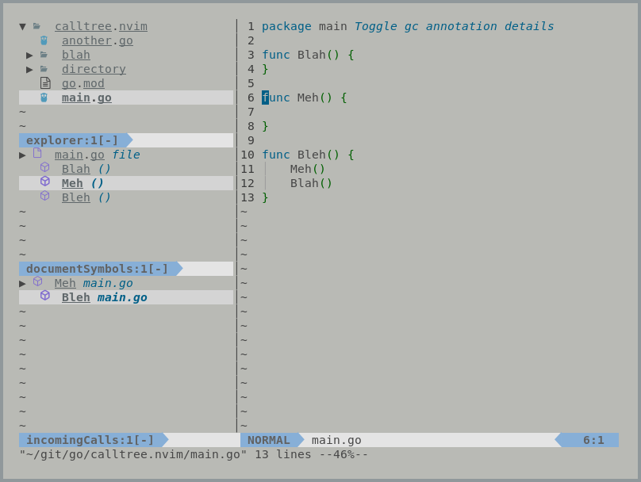

```
██╗     ██╗████████╗███████╗███████╗   ███╗   ██╗██╗   ██╗██╗███╗   ███╗
██║     ██║╚══██╔══╝██╔════╝██╔════╝   ████╗  ██║██║   ██║██║████╗ ████║ Lightweight
██║     ██║   ██║   █████╗  █████╗     ██╔██╗ ██║██║   ██║██║██╔████╔██║ Integrated
██║     ██║   ██║   ██╔══╝  ██╔══╝     ██║╚██╗██║╚██╗ ██╔╝██║██║╚██╔╝██║ Text
███████╗██║   ██║   ███████╗███████╗██╗██║ ╚████║ ╚████╔╝ ██║██║ ╚═╝ ██║ Editing
╚══════╝╚═╝   ╚═╝   ╚══════╝╚══════╝╚═╝╚═╝  ╚═══╝  ╚═══╝  ╚═╝╚═╝     ╚═╝ Environment
====================================================================================
```



# litee-filetree

litee-filetree utilizes the [litee.nvim](https://github.com/ldelossa/litee.nvim) library to 
implement a tool analogous to VSCode's "Explorer" tool. 

This tool exposes an explorable tree of files and directories.

Unlike other Neovim plugins, renames of files are correctly handled and recursive moves
and copies are supported.

Like all `litee.nvim` backed plugins the UI will work with other `litee.nvim` plugins, 
keeping its appropriate place in a collapsible panel.

# Usage

## Get it

Plug:
```
 Plug 'ldelossa/litee.nvim'
 Plug 'ldelossa/litee-filetree.nvim'
```

## Set it

Call the setup function from anywhere you configure your plugins from.

Configuration dictionary is explained in ./doc/litee-filetree.txt (:h litee-filetree-config)

```
-- configure the litee.nvim library 
require('litee.lib').setup({})
-- configure litee-filetree.nvim
require('litee.filetree').setup({})
```

## Use it

First ensure you also have the litee.nvim (https://github.com/ldelossa/litee.nvim) 
library installed.

The Filetree UI can be opened with a call to ":LTOpenFiletree" or "LTPopOutFiletree", 
the former being in the the `litee.nvim` panel and latter opened as a popout panel.

Once the Filetree is open checkout out (h: litee-filetree-commands) to view available 
actions you can take on a Filetree. You can also hit "?" while inside the Filetree
to buffer local keymaps.

Certain functionality like "moving" and "copying" require selecting a Filetree
node first (defaults to s (select) and S (deselect) when inside a Filetree UI window.

Commands which require a selection are noted in comments within the `litee-filetree-commands`
section of the help file.
